# SIGTVA — Implementación de patrones de diseño

Aplicación Flask en **tres capas** (MVC) que implementa un proceso por patrón:

| Patrón | Proceso | Dónde está |
|---|---|---|
| **Factory Method** | Venta de tiquete: creación de la tarifa | `factories/fabrica_tarifa.py` |
| **Abstract Factory** | Registro de envío (Paqueteo / Corporativa / Remesa) | `factories/fabrica_envio.py` — cliente: `services/servicio_registro_envio.py` |
| **Builder** | Venta de tiquete | `builders/constructor_tiquete.py` |
| **Prototype** | Registro de envío: remesa múltiple por clonación | `prototypes/prototipos_envio.py` — cliente: `services/servicio_prototipos.py` |
| **Singleton** | Venta de tiquete: bloqueo, consecutivo y caché única | `singletons/` (gestor, secuenciadores, validador) |

En la venta de tiquete los patrones **componen**: la `Tarifa` la crea el Factory Method y el Builder la recibe ya creada; en el registro de envío, cada guía clonada por Prototype se numera con el SecuenciadorGuia (Singleton).

## Capas

| Capa | Carpetas / archivos |
|---|---|
| Presentación (vista + controlador) | `app.py`, `templates/` |
| Lógica de negocio | `services/`, `factories/`, `builders/`, `prototypes/`, `singletons/`, `domain/` |
| Datos | `dao/`, `models/` |

Regla de dependencias: datos solo usa datos; lógica usa lógica y datos; presentación usa lógica (los procesos) y, en tres rutas de consulta, datos directamente.

## Ejecución

```bash
pip install -r requirements.txt
python app.py            # http://127.0.0.1:5000  (crea la BD y datos de prueba solos)
```

Tras cada compra o envío, la factura muestra el panel **«Patrones en acción»** con los pasos reales de cada patrón.

## Demos por consola (una por patrón)

```bash
python demos/demo_factory_method.py
python demos/demo_abstract_factory.py
python demos/demo_builder.py
python demos/demo_prototype.py
python demos/demo_singleton.py
```

## Calidad

```bash
python -m ruff check .   # limpio: imports ordenados, sin excepciones ciegas,
                         # datetimes con zona, anotaciones modernas
```

## Pantallazos solicitados (12)

Carpeta: `docs/pantallazos/` — ver directo en `main`.

1. Arranque — `docs/pantallazos/01_arranque.png`
2. Inicio — `docs/pantallazos/02_inicio.png`
3. Consola Factory Method — `docs/pantallazos/03_consola_factory_method.png`
4. Selección de tarifa en la web — `docs/pantallazos/04_seleccion_tarifa_web.png`
5. Consola Abstract Factory — `docs/pantallazos/05_consola_abstract_factory.png`
6. Formulario de registro de envío — `docs/pantallazos/06_formulario_envio.png`
7. Factura del envío con el panel — `docs/pantallazos/07_factura_envio_panel.png`
8. Regla de la familia en la web — `docs/pantallazos/08_regla_familia_web.png`
9. Demo por consola de Builder — `docs/pantallazos/09_consola_builder.png`
10. Compra de tiquete en la web — `docs/pantallazos/10_compra_tiquete_web.png`
11. Demo por consola de Prototype — `docs/pantallazos/11_consola_prototype.png`
12. Demo por consola de Singleton — `docs/pantallazos/12_consola_singleton.png`

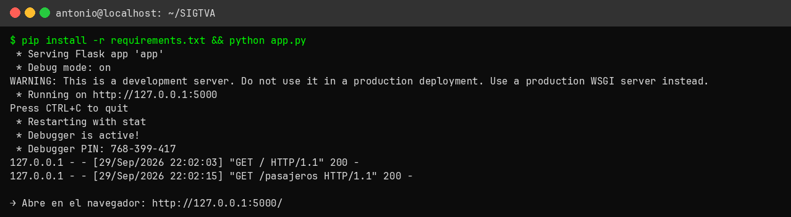
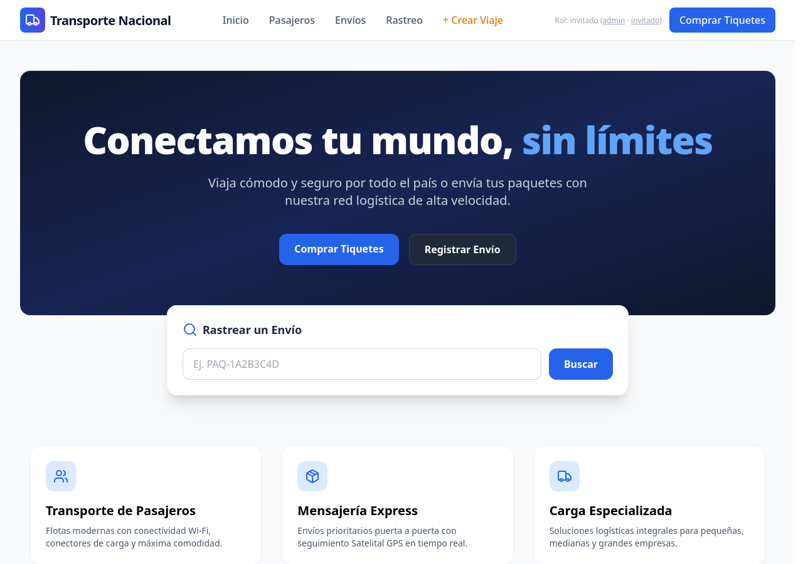
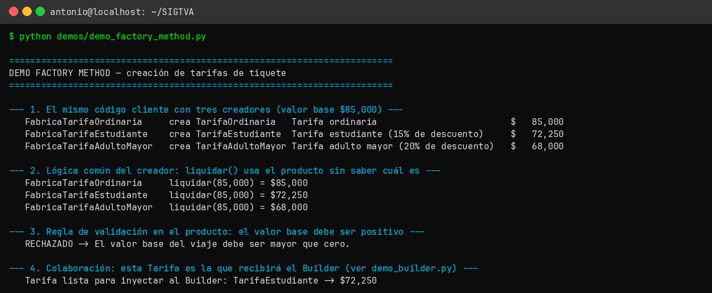
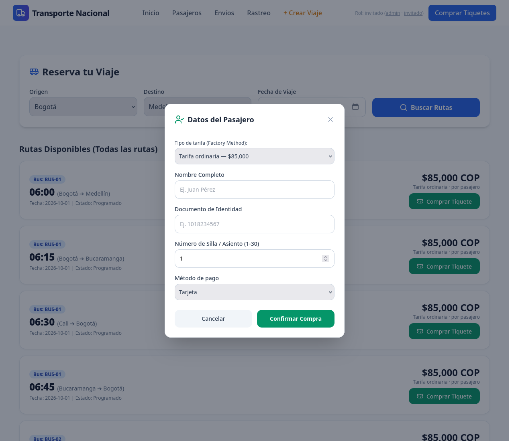
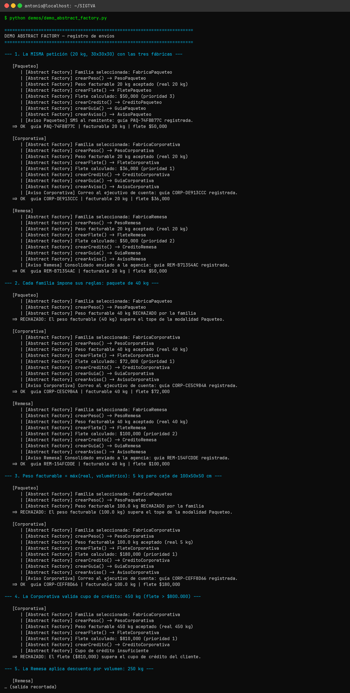
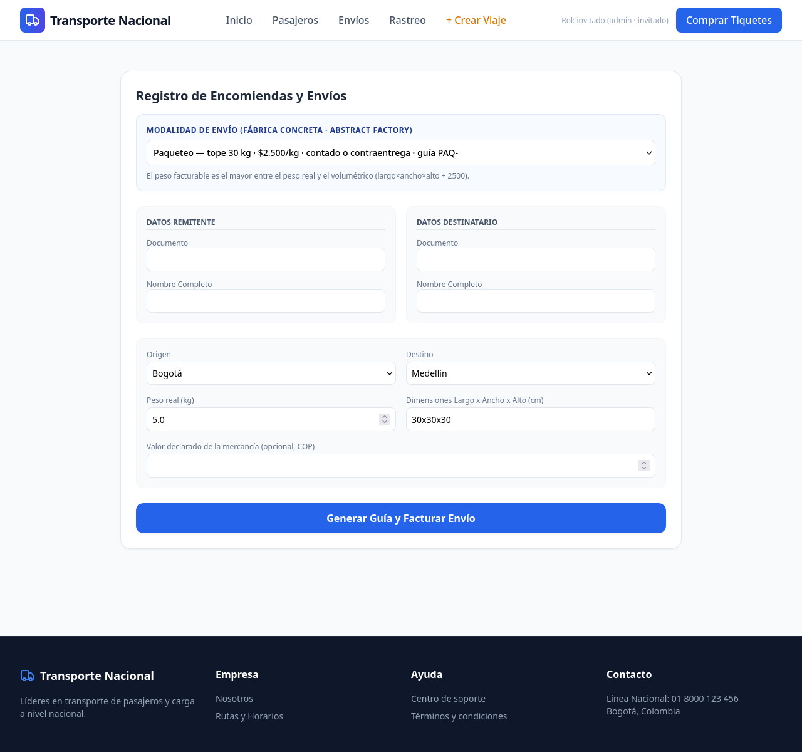
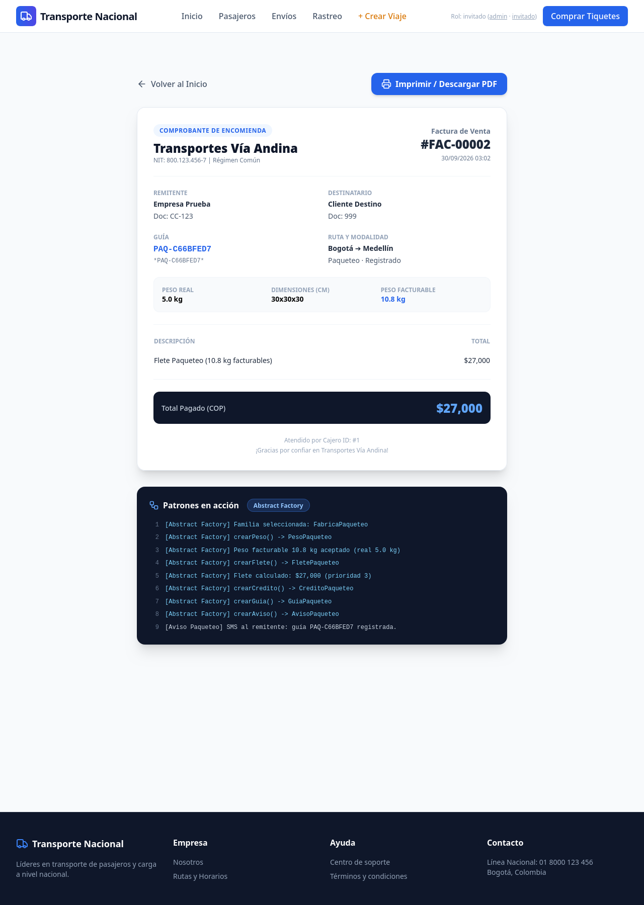
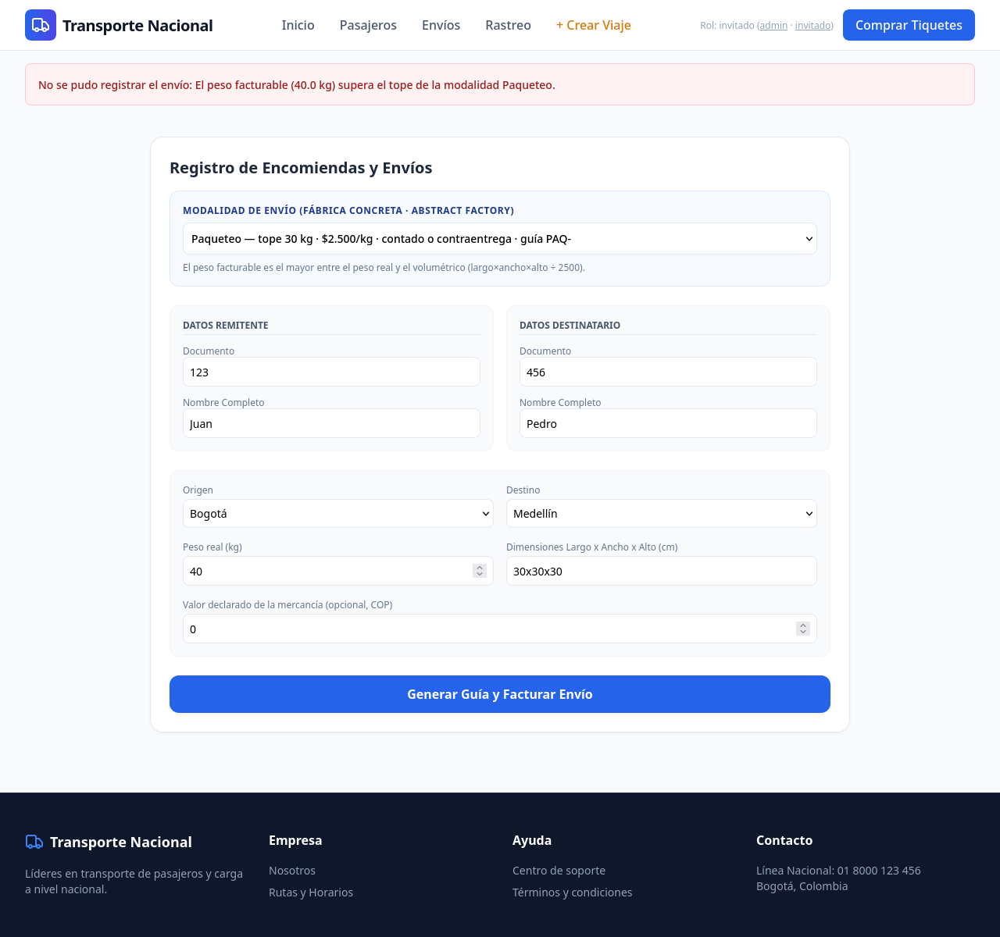
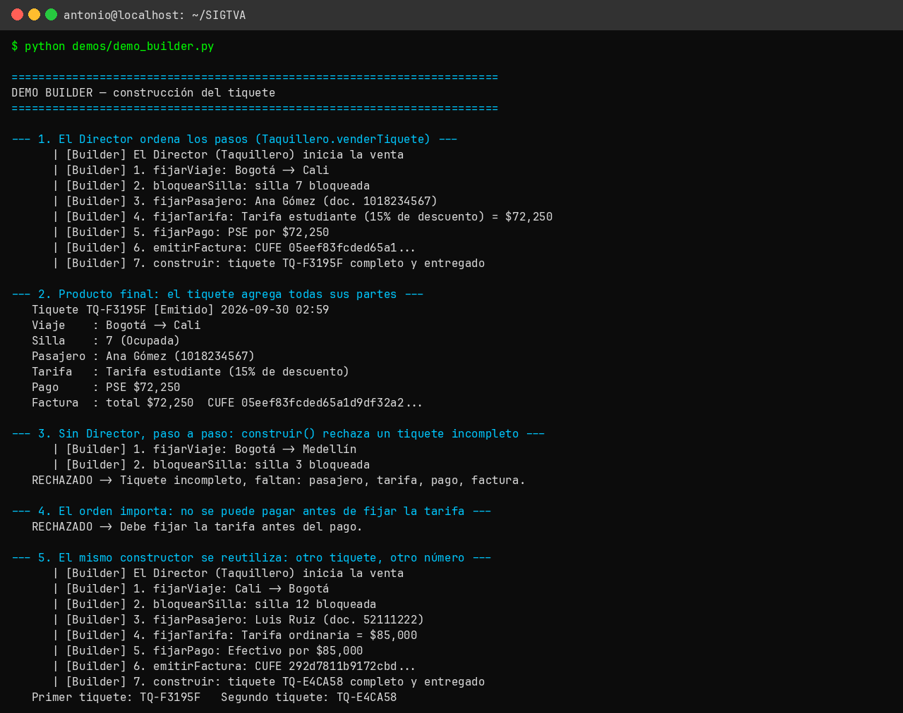
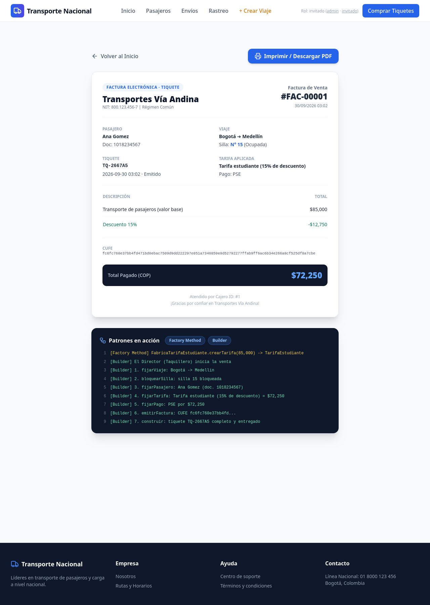
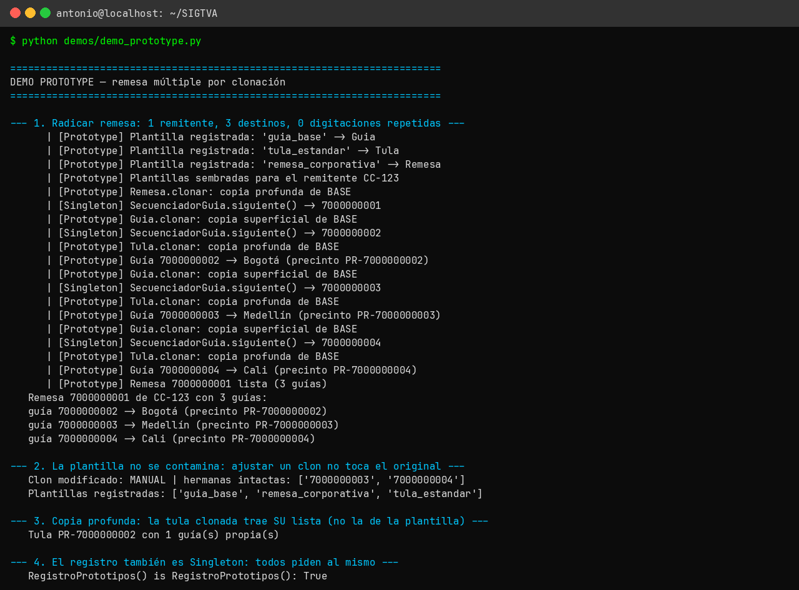
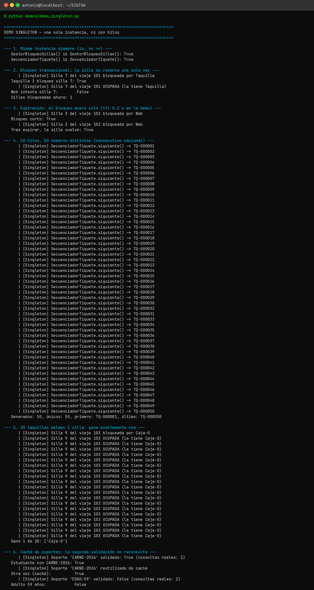


